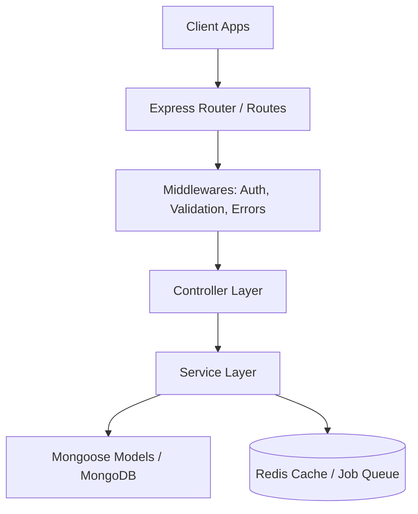

# System Architecture

This document describes the design patterns, architectural layers, and data flow of the Split Ride backend.

## Layered Architecture

The project uses a standard layered architecture to separate concerns, improve maintainability, and ensure scalability:

### 1. Routing Layer (`*.routes.ts`)
- Defines application endpoints.
- Plugs in route-level middlewares (e.g., authentication, role check, request validation).
- Delegates requests directly to the corresponding controller.

### 2. Controller Layer (`*.controller.ts`)
- Extracts inputs (route parameters, query string, request body, authentication credentials).
- Delegates business logic execution to the Service layer.
- Uses `catchAsync` wrapper utility to automatically pass any errors to the global error handler.
- Standardizes HTTP responses using the `sendResponse` utility.

### 3. Service Layer (`*.service.ts`)
- Houses all application business logic (e.g., calculations, validation checks, database actions).
- Interacts with database models to perform CRUD operations.
- Interacts with Redis, Bull Queue, Socket.io, or other third-party services (like Stripe or Twilio).

### 4. Database Layer / ODM (`*.model.ts`, `*.interface.ts`)
- Uses Mongoose ODM to declare schemas and define indexes.
- Enforces data integrity via type validations and mongoose schema settings.
- Employs helper builders (e.g., `QueryBuilder`) for advanced searches, sorting, pagination, and fields selection.

---

## Key Design Patterns & Tools

### QueryBuilder
A utility class (`QueryBuilder.ts`) used to build dynamic Mongoose queries. It provides chainable helpers:
- `search(searchableFields)`: Regex search on specific schema fields.
- `filter()`: Generic filtering of match conditions.
- `sort()`: Sorting results dynamically based on sorting query parameters.
- `paginate()`: Pagination skipping and page limits.
- `fields()`: Selective projection of document fields.
- `countTotal()`: Counting total matched documents.

### Global Error Handling
Errors are caught by the `catchAsync` wrapper and propagated to the global error middleware in `app.ts` using Express' `next(error)` function. The middleware processes `ApiError` instances and structures response details safely.
