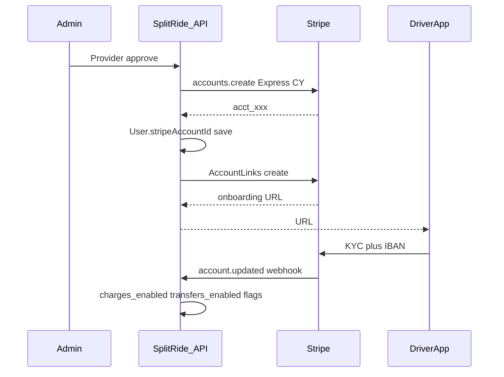
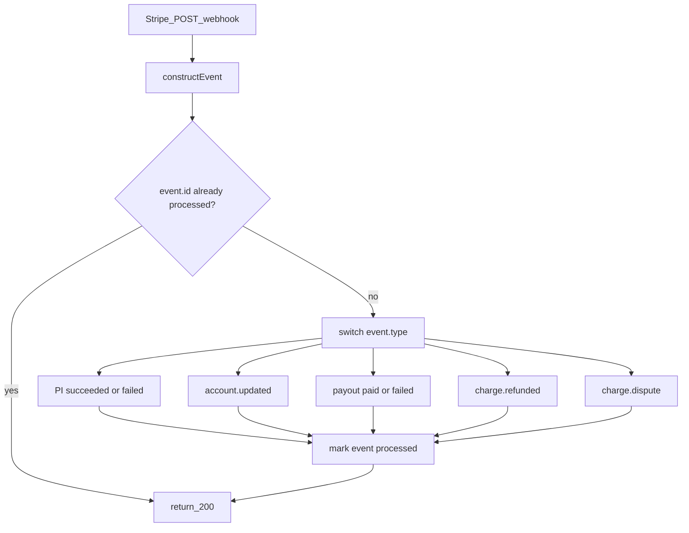

# Stripe Connect অনবোর্ডিং ও ড্রাইভার পেমেন্ট (SplitRide)

এই ডকুমেন্ট ব্যাখ্যা করে ক্লায়েন্ট Stripe Connect দিয়ে কী চেয়েছে, ব্যাকএন্ডে কীভাবে কাজ করবে, বর্তমান কোডের অবস্থা, কোথায় কোথায় পরিবর্তন আসবে, এবং Stripe Dashboard থেকে কী কনফিগ লাগবে।

> নোট: এটি ডিজাইন/অনবোর্ডিং ডক। প্রোডাকশন কোড চেঞ্জ আলাদা ইমপ্লিমেন্টেশন ট্যাস্কে হবে। আগে **Stripe test mode**-এ ফ্লো টেস্ট করতে হবে।

---

## ১. ক্লায়েন্ট কী বুঝিয়েছে

সংক্ষেপে ক্লায়েন্টের মডেল:

| বিষয় | মানে |
|---|---|
| মূল Stripe অ্যাকাউন্ট | SplitRide প্ল্যাটফর্মের |
| ড্রাইভার | আগে থেকে নিজের Stripe অ্যাকাউন্ট লাগবে না |
| অনবোর্ডিং | Stripe-hosted/embedded দিয়ে KYC + আইডি + IBAN Stripe-ই নেবে |
| ব্যাংক/আইডি স্টোর | আমরা নিজেরা রাখব না; Stripe ম্যানেজ করবে |
| রাইড পেমেন্ট | রাইডার → SplitRide মেইন ইন্টিগ্রেশন |
| স্প্লিট | উদাহরণ: €100 → প্ল্যাটফর্ম €10 (১০%), ড্রাইভার €90 (৯০%) |
| পেআউট | প্রতি ট্রিপের পর নয়; সাপ্তাহিক Connected Account → IBAN |
| স্ট্যাটাস | Verification, charges/transfers enabled, payouts enabled জানা যাবে |
| ওয়েবহুক | সফল/ব্যর্থ পেমেন্ট, অ্যাকাউন্ট আপডেট, payout, refund, dispute — ফ্রন্টএন্ড রেসপন্স দিয়ে completed মার্ক নয় |

**টার্গেট ইউজার জার্নি**

1. ড্রাইভার রেজিস্ট্রেশন  
2. অ্যাডমিন অ্যাপ্রুভাল  
3. Stripe Connect অনবোর্ডিং  
4. KYC + IBAN  
5. Stripe ভেরিফিকেশন  
6. পেমেন্টের জন্য অ্যাকটিভ  

**পেমেন্ট জার্নি**

1. রাইডার পেমেন্ট  
2. SplitRide কমিশন কেটে নেওয়া  
3. ড্রাইভার শেয়ার Connected Account-এ অ্যালোকেট  
4. সাপ্তাহিক payout → ড্রাইভারের IBAN  

---

## ২. Stripe Connect অনবোর্ডিং মানে কী

**Stripe Connect** মাল্টি-পার্টি মার্কেটপ্লেসের জন্য। SplitRide প্ল্যাটফর্ম; প্রতিটি ড্রাইভার একটি **Connected Account** (`acct_...`)।

**অনবোর্ডিং** মানে ড্রাইভারকে Stripe-এর হোস্টেড/এমবেডেড ফর্ম দেখানো, যেখানে সে:

- পরিচয় / KYC তথ্য দেয়  
- প্রয়োজনীয় ডকুমেন্ট আপলোড করে (Stripe স্টোর করে)  
- ব্যাংক অ্যাকাউন্ট / IBAN যোগ করে  

আমাদের ব্যাকএন্ড শুধু:

- Express Connected Account তৈরি করে  
- `AccountLinks` (বা Account Session) দিয়ে অনবোর্ডিং URL দেয়  
- `User.stripeAccountId` সেভ করে  
- ওয়েবহুক `account.updated` দিয়ে `charges_enabled`, `payouts_enabled`, requirements ইত্যাদি আপডেট করে  

ড্রাইভারকে আগে থেকে `acct_` আইডি বা আলাদা Stripe ড্যাশবোর্ড অ্যাকাউন্ট বানাতে বলতে হবে না। SplitRide-ই তার জন্য Connected Account তৈরি করবে।

---

## ৩. বর্তমান কোডের অবস্থা

| বিষয় | এখন কী আছে | গ্যাপ |
|---|---|---|
| Connect অ্যাকাউন্ট তৈরি | আছে — `POST /api/v1/stripe/connect` Express অ্যাকাউন্ট + Account Link | কান্ট্রি এখন `US` হার্ডকোড; সাইপ্রাসের জন্য `CY` + EUR লাগবে |
| অ্যাকাউন্ট আইডি সেভ | `User.stripeAccountId` | Verification / charges / payouts ফ্ল্যাগ পূর্ণ নয় |
| Existing connect / disconnect / check | আছে (`/connect-existing`, `/disconnect`, `/check-connection`) | ক্লায়েন্ট মডেলে “আগে থেকে অ্যাকাউন্ট” মূল পথ নয় |
| রাইড PaymentIntent | মূল প্ল্যাটফর্ম অ্যাকাউন্টে `capture_method: manual` | Destination charge / `application_fee_amount` / `transfer_data.destination` নেই |
| ড্রাইভার আয় | `driverEarningAmount`, wallet, withdraw মডিউল | সাপ্তাহিক Stripe payout schedule নেই |
| ওয়েবহুক | পেমেন্ট ফ্লো আংশিক | Connect account + payout + dispute পূর্ণ কভারেজ দরকার |

প্রাসঙ্গিক ফাইল:

- [`server/src/app/modules/stripe/stripe.service.ts`](../server/src/app/modules/stripe/stripe.service.ts)  
- [`server/src/app/modules/stripe/stripe.route.ts`](../server/src/app/modules/stripe/stripe.route.ts)  
- [`server/src/app/config/stripe.config.ts`](../server/src/app/config/stripe.config.ts)  
- [`server/src/app/modules/payment/payment.service.ts`](../server/src/app/modules/payment/payment.service.ts)  
- [`server/src/app/modules/withdraw/`](../server/src/app/modules/withdraw/)  

---

## ৪. ব্যাকএন্ডে এন্ড-টু-এন্ড ফ্লো

### ৪.১ ড্রাইভার অনবোর্ডিং



ধাপ:

1. ড্রাইভার রেজিস্টার করে; প্রোভাইডার স্ট্যাটাস `pending`।  
2. অ্যাডমিন অ্যাপ্রুভ করে।  
3. ব্যাকএন্ড Stripe-এ Express Connected Account তৈরি করে (`country: CY`, EUR capabilities)।  
4. `User.stripeAccountId = acct_...` সেভ।  
5. Account Link URL ড্রাইভার অ্যাপে পাঠানো।  
6. ড্রাইভার Stripe পেজে KYC + IBAN সম্পন্ন করে।  
7. ওয়েবহুক `account.updated` → DB-তে স্ট্যাটাস আপডেট (`charges_enabled`, `payouts_enabled`, requirements)।  
8. স্ট্যাটাস ঠিক হলে ড্রাইভার পেমেন্ট গ্রহণের জন্য অ্যাকটিভ।  

অনবোর্ডিং অসম্পূর্ণ থাকলে রিফ্রেশ লিঙ্ক (`/stripe/refresh/:id`) দিয়ে আবার পাঠানো যায়।

### ৪.২ রাইড পেমেন্ট স্প্লিট (প্রস্তাবিত)

এক ড্রাইভার প্রতি রাইড মডেলের জন্য উপযুক্ত আর্কিটেকচার: **Destination charges** + **application fee**।

উদাহরণ (ক্লায়েন্টের ১০%/৯০%):

- রাইড টোটাল: €100  
- `application_fee_amount`: €10 → SplitRide  
- Connected Account ব্যালেন্স: €90 → ড্রাইভার  

ফ্লো:

1. রাইডার PaymentIntent অথরাইজ/ক্যাপচার (বর্তমান manual capture ফ্লো রাখা যায়)।  
2. ক্যাপচারের সময় (বা সফল চার্জের সময়) `transfer_data.destination = driver.stripeAccountId` এবং `application_fee_amount` সেট।  
3. ড্রাইভারের শেয়ার Connected Account ব্যালেন্সে জমা থাকে।  
4. সাপ্তাহিক schedule অনুযায়ী Stripe স্বয়ংক্রিয়ভাবে IBAN-এ পাঠায়।  

**বিজনেস নোট:** কোডে এখন আলাদা `driverPlatformFeePercent` (যেমন ১৫%) ও `driverVatPercent` (যেমন ১৯%) আছে। ক্লায়েন্ট মেইলে সরল ১০%/৯০% বলেছে। ইমপ্লিমেন্টেশনের আগে কোন মডেল ফাইনাল তা প্রোডাক্ট/ক্লায়েন্টের সাথে মিলিয়ে নিতে হবে। এই ডকের ডিফল্ট বর্ণনা ক্লায়েন্টের ১০/৯০ অনুসরণ করে।

### ৪.৩ সাপ্তাহিক পেআউট

- Connected Account তৈরি/আপডেটের সময়:  
  `settings.payouts.schedule.interval = 'weekly'` (দিন সেট করা যায়, যেমন সোমবার)।  
- সপ্তাহজুড়ে আয় Connected Account-এ জমে।  
- Stripe স্বয়ংক্রিয় payout → রেজিস্টার্ড IBAN।  
- অ্যাপে দেখানোর জন্য Stripe Balance API + `payout.*` ওয়েবহুক + লোকাল হিস্ট্রি।  

প্রয়োজনীয় অ্যাপ ফিল্ড (ক্লায়েন্ট চেয়েছে):

- Total ride earnings  
- SplitRide commission  
- Driver net earnings  
- Pending balance  
- Available balance  
- Paid amount  
- Next payout  
- Payout history  

### ৪.৪ ওয়েবহুক (বাধ্যতামূলক)

এখন কোডবেসে **কোনো Stripe webhook হ্যান্ডলার নেই**। শুধু `.env.example`-এ `STRIPE_WEBHOOK_SECRET` আছে। ক্লায়েন্ট ডক অনুযায়ী নিচের অংশগুলো **নতুন করে ইমপ্লিমেন্ট** করতে হবে।

#### ক্লায়েন্ট কেন ওয়েবহুক চায়

- সফল/ব্যর্থ পেমেন্ট, ড্রাইভার অ্যাকাউন্ট ভেরিফিকেশন, সফল/ব্যর্থ payout, রিফান্ড, ডিসপিউট — রিয়েল টাইম আপডেট।  
- **ফ্রন্টএন্ড / SDK রেসপন্স দিয়ে কখনো completed মার্ক নয়** — শুধু Stripe webhook কনফার্মেশনের পর DB আপডেট।  

#### কী ইমপ্লিমেন্ট করতে হবে (ইনফ্রা)

| আইটেম | বিস্তারিত |
|---|---|
| এন্ডপয়েন্ট | যেমন `POST /api/v1/payments/webhook` বা `POST /api/v1/stripe/webhook` |
| Raw body | Express-এ এই রুটে `express.raw({ type: 'application/json' })` — JSON পার্সারের আগে, নাহলে সিগনেচার ফেল করবে |
| সিগনেচার ভেরিফাই | `stripe.webhooks.constructEvent(rawBody, stripe-signature, STRIPE_WEBHOOK_SECRET)` |
| Env | `STRIPE_WEBHOOK_SECRET` (`whsec_...`) — test mode আলাদা, live আলাদা |
| Dashboard | Stripe Dashboard → Developers → Webhooks → endpoint URL + নিচের ইভেন্ট সিলেক্ট |
| Connect ইভেন্ট | Connected Account ইভেন্টের জন্য webhook-এ “Listen to events on Connected accounts” চালু রাখা (অ্যাকাউন্ট/payout ইভেন্টের জন্য) |
| Idempotency | একই `event.id` দুবার এলে দ্বিতীয়বার স্কিপ — `StripeWebhookEvent` কালেকশন বা Redis সেট |
| রেসপন্স | ভেরিফাই ও কিউ/প্রসেস শুরু হলে দ্রুত `200` — লম্বা কাজ অ্যাসিঙ্ক |

প্রস্তাবিত ফাইল স্ট্রাকচার:

- `server/src/app/modules/payment/payment.webhook.ts` (বা `stripe/stripe.webhook.ts`) — ইভেন্ট রাউটার  
- `payment.routes.ts` / `stripe.route.ts` — webhook রুট (auth ছাড়া; শুধু Stripe সিগনেচার)  
- `env.config.ts` — `STRIPE_WEBHOOK_SECRET` লোড  

#### ক্লায়েন্ট ইভেন্ট → ব্যাকএন্ড অ্যাকশন

| Stripe ইভেন্ট | ক্লায়েন্ট অর্থ | ব্যাকএন্ডে কী করতে হবে |
|---|---|---|
| `payment_intent.succeeded` | Successful payment | `Payment` → `paid` / `succeeded`; booking `paymentStatus` আপডেট; প্রয়োজনে capture/amount ফাইনাল মার্ক। **এই ওয়েবহুক ছাড়া paid মার্ক নয়।** |
| `payment_intent.payment_failed` | Failed payment | `Payment` → `failed`; booking/passenger স্ট্যাটাস অনুযায়ী; রাইডার/অ্যাপে নোটিফাই (ঐচ্ছিক) |
| `payment_intent.canceled` | Auth বাতিল (optional কিন্তু উপযোগী) | authorized বাতিল হলে DB `cancelled_authorization` |
| `charge.refunded` | Refunds | `Payment` → `refunded`; `Refund` রেকর্ড; wallet/Connect অনুযায়ী ব্যালেন্স অ্যাডজাস্ট |
| `charge.dispute.created` | Disputes শুরু | dispute স্ট্যাটাস সেভ; অ্যাডমিন অ্যালার্ট; প্রয়োজনে payout/earning হোল্ড ফ্ল্যাগ |
| `charge.dispute.closed` | Disputes শেষ | won/lost অনুযায়ী ফাইনাল স্ট্যাটাস |
| `account.updated` | Driver account/verification updates | `User`/`Provider`: `detailsSubmitted`, `chargesEnabled`, `payoutsEnabled`, `requirements.currently_due`; অসম্পূর্ণ থাকলে অনবোর্ড pending |
| `account.application.deauthorized` (ঐচ্ছিক) | Connect কেটে গেলে | `stripeAccountId` ক্লিয়ার / ড্রাইভার পেমেন্ট অক্ষম |
| `payout.paid` | Successful payouts | payout হিস্ট্রি → `paid`; paidAmount বাড়ানো; ড্রাইভার নোটিফাই |
| `payout.failed` | Failed payouts | payout → `failed` + failure reason; ড্রাইভার/অ্যাডমিন নোটিফাই; IBAN/requirements চেক |
| `payout.canceled` (ঐচ্ছিক) | Payout বাতিল | হিস্ট্রি আপডেট |

> ক্লায়েন্ট লিস্টে সরাসরি না থাকলেও Connect-এ প্রায়ই লাগে: `transfer.created` / `transfer.failed` (destination charge-এ ড্রাইভার শেয়ার ট্র্যাক করতে)।

#### ইভেন্ট অনুযায়ী মিনিমাম ডেটা মডেল

**পেমেন্ট**

- `paymentIntentId`, `status`, `amount`, `webhookConfirmedAt`, `lastStripeEventId`

**ড্রাইভার Connect স্ট্যাটাস** (`User` বা `Provider`)

- `stripeAccountId`  
- `stripeDetailsSubmitted`  
- `stripeChargesEnabled`  
- `stripePayoutsEnabled`  
- `stripeRequirementsDue` (array/string)  
- `stripeOnboardingStatus`: `not_started` \| `pending` \| `complete` \| `restricted`

**Payout হিস্ট্রি** (নতুন কালেকশন বা withdraw সম্প্রসারণ)

- `stripePayoutId`, `driverId`, `amount`, `currency`, `arrivalDate`, `status`, `failureCode`, `failureMessage`

**Webhook idempotency**

- `eventId` (unique), `type`, `processedAt`

#### প্রসেসিং অর্ডার (সাজেস্টেড)



#### টেস্ট মোডে ওয়েবহুক কীভাবে চেক করবে

1. Stripe CLI: `stripe listen --forward-to localhost:PORT/api/v1/payments/webhook`  
2. Dashboard বা CLI দিয়ে টেস্ট ইভেন্ট ট্রিগার (`payment_intent.succeeded`, `account.updated`, `payout.paid`)  
3. DB-তে স্ট্যাটাস শুধু webhook হ্যান্ডলার চালু হওয়ার পর বদলেছে কিনা যাচাই  
4. একই ইভেন্ট দুবার পাঠিয়ে idempotent কিনা দেখা  

#### ইমপ্লিমেন্টেশন চেকলিস্ট (ওয়েবহুক অংশ)

- [ ] Webhook রুট + raw body + `constructEvent`  
- [ ] `STRIPE_WEBHOOK_SECRET` env + Dashboard endpoint (test)  
- [ ] Connected accounts ইভেন্ট লিসেন অন  
- [ ] `payment_intent.succeeded` / `payment_failed` → Payment/Booking  
- [ ] `account.updated` → ড্রাইভার verification flags  
- [ ] `payout.paid` / `payout.failed` → payout history  
- [ ] `charge.refunded` → Refund + payment status  
- [ ] `charge.dispute.*` → dispute স্ট্যাটাস  
- [ ] `event.id` idempotency  
- [ ] ফ্রন্টএন্ড সাকসেস দিয়ে paid/payout completed মার্ক বন্ধ / ওয়েবহুক-অনলি ফাইনাল স্টেট  

---

## ৫. কোথায় কোথায় চেঞ্জ আসবে

| এলাকা | ফাইল / মডিউল | কী করবে |
|---|---|---|
| Connect অনবোর্ডিং | `server/src/app/modules/stripe/stripe.service.ts`, `stripe.config.ts`, `stripe.route.ts` | `CY`/EUR, weekly payout schedule, স্ট্যাটাস API উন্নত করা |
| ইউজার ফ্ল্যাগ | `server/src/app/modules/user/user.model.ts` | `stripeAccountId` ছাড়াও `chargesEnabled`, `payoutsEnabled`, `detailsSubmitted`, requirements ইত্যাদি |
| অ্যাপ্রুভাল ট্রিগার | `server/src/app/modules/provider/provider.service.ts` | অ্যাপ্রুভ হলে অ্যাকাউন্ট তৈরি বা অনবোর্ড লিঙ্ক জেনারেট |
| রাইড পেমেন্ট | `server/src/app/modules/payment/payment.service.ts` | PI-তে `application_fee_amount` + `transfer_data.destination` |
| রাইড কমপ্লিট / আয় ক্রেডিট | ride complete হ্যান্ডলার / related job | Connect অ্যালোকেশনের সাথে `driverEarningAmount` সামঞ্জস্য |
| ওয়েবহুক | নতুন `payment.webhook.ts` (বা `stripe.webhook.ts`) + রুট | §৪.৪ ইভেন্ট হ্যান্ডলার, raw body, idempotency |
| আয় / ব্যালেন্স API | নতুন earnings মডিউল বা `withdraw` রিফ্যাক্টর | pending/available/paid/next payout/history |
| কনফিগ | `.env` / `env.config.ts` | test keys, webhook secret, Connect return/refresh URL |

---

## ৬. অ্যাপে ড্রাইভার কী দেখবে (হাই লেভেল API ধারণা)

ইমপ্লিমেন্টেশনে আলাদা এন্ডপয়েন্ট ডিজাইন করা যাবে; ধারণাগতভাবে:

```json
{
  "stripeAccountId": "acct_xxx",
  "verification": {
    "detailsSubmitted": true,
    "chargesEnabled": true,
    "payoutsEnabled": true
  },
  "earnings": {
    "totalRideEarnings": 1000.0,
    "platformCommission": 100.0,
    "driverNetEarnings": 900.0,
    "pendingBalance": 120.0,
    "availableBalance": 80.0,
    "paidAmount": 700.0,
    "nextPayout": "2026-10-06"
  },
  "payoutHistory": []
}
```

অনবোর্ডিং শুরু:

- `POST /api/v1/stripe/connect` → অনবোর্ডিং URL  
- অসম্পূর্ণ হলে refresh URL  

স্ট্যাটাস চেক:

- `GET /api/v1/stripe/check-connection` (সম্প্রসারিত: charges/payouts ফ্ল্যাগসহ)  

---

## ৭. Stripe Dashboard থেকে যা লাগবে (আমাদের সাইড)

ইমপ্লিমেন্টেশন/টেস্ট শুরুর আগে ক্লায়েন্ট বা অ্যাডমিন থেকে:

1. **Connect প্ল্যাটফর্ম প্রোফাইল** সম্পূর্ণ (responsibilities accept) — না হলে `platform_profile_incomplete` এরর আসে।  
2. **Test mode** API keys (`sk_test_...`, `pk_test_...`)।  
3. **Webhook endpoint** + signing secret (`whsec_...`) — উপরের ইভেন্টগুলো সিলেক্ট করে।  
4. দেশ/কারেন্সি: **Cyprus (`CY`)**, **EUR**।  
5. Connected Account ডিফল্ট বা অ্যাকাউন্ট-লেভেল **weekly payout** সেটিং।  
6. Return / refresh URL (যেমন সার্ভারের `/stripe/return`, `/stripe/refresh/:id` বা অ্যাপ ডিপ লিঙ্ক) হোয়াইটলিস্ট/কনফিগ।  
7. প্ল্যাটফর্মের বিজনেস / ট্যাক্স তথ্য Dashboard-এ আপডেট।  
8. টেস্ট মোডে সম্পূর্ণ ফ্লো পাস করার পরই Production keys ও webhook।  

---

## ৮. টেস্ট চেকলিস্ট (Test mode)

- [ ] ড্রাইভার অ্যাপ্রুভ → Connected Account তৈরি → `acct_` DB-তে  
- [ ] অনবোর্ডিং URL খুলে টেস্ট KYC + টেস্ট IBAN সম্পন্ন  
- [ ] `account.updated` ওয়েবহুক → charges/payouts enabled  
- [ ] রাইড পেমেন্ট → application fee + destination ব্যালেন্স  
- [ ] রিফান্ড / ব্যর্থ পেমেন্ট ওয়েবহুক  
- [ ] সাপ্তাহিক payout (টেস্টে schedule/ম্যানুয়াল ট্রিগার) → `payout.paid` / `payout.failed`  
- [ ] অ্যাপে earnings / balance / history দেখা  

---

## ৯. সংক্ষেপ

ক্লায়েন্ট চায়: ড্রাইভার নিজে Stripe অ্যাকাউন্ট না খুলে SplitRide Connect অনবোর্ডিংয়ে KYC+IBAN দেবে; রাইডার পেমেন্ট প্ল্যাটফর্মে যাবে; কমিশন কেটে বাকি Connected Account-এ জমাবে; সাপ্তাহিক Stripe payout IBAN-এ যাবে; স্ট্যাটাস ও সম্পন্নতা ওয়েবহুক দিয়ে নিশ্চিত হবে।

ব্যাকএন্ডে আংশিক Connect স্ক্যাফোল্ড আছে; মূল কাজ হবে দেশ/EUR ঠিক করা, **অ্যাপ্রুভালে অটো Connected Account**, PaymentIntent-এ destination + application fee, weekly payout, পূর্ণ ওয়েবহুক, এবং অ্যাপে earnings API।

---

## ১০. মিসিং আইটেম — কী করা যাবে (ইমপ্লিমেন্টেশন গাইড)

ক্লায়েন্ট ওভারভিউর সাথে মিলিয়ে যে জিনিসগুলো কোডে এখনো নেই বা আংশিক, সেগুলো **সবই করা যাবে**। নিচে প্রতিটির জন্য: এখন কী আছে → কী করব → কোথায়।

### ১০.১ অ্যাপ্রুভের সাথে অটো Connected Account তৈরি — করা যাবে

| | |
|---|---|
| **এখন** | অ্যাডমিন `PROVIDER_STATUS.verified` করলে শুধু User KYC + ইমেইল/FCM (`provider.service.ts`)। Stripe অ্যাকাউন্ট ড্রাইভার নিজে `POST /api/v1/stripe/connect` ডেকে বানায়; country হার্ডকোড `US`। |
| **ক্লায়েন্ট চায়** | অ্যাপ্রুভের পর ব্যাকএন্ড নিজে Connected Account তৈরি করবে এবং `stripeAccountId` সেভ করবে। |
| **কী করব** | `updateProviderStatus` → `verified` হলে (ট্রানজেকশন কমিটের পর বা সেই ফ্লোতে): |

1. যদি `user.stripeAccountId` না থাকে → `stripe.accounts.create`  
   - `type: 'express'`  
   - `country: 'CY'`  
   - `capabilities`: `card_payments` + `transfers` requested  
   - `settings.payouts.schedule.interval: 'weekly'`  
2. `User.stripeAccountId` সেভ + অনবোর্ডিং স্ট্যাটাস `pending`  
3. `AccountLinks.create` → onboarding URL  
4. URL ড্রাইভারকে পাঠানো (push / email / `GET` দিয়ে অ্যাপে পরে নেওয়া)  
5. অ্যাপে ড্রাইভার Stripe-hosted অনবোর্ডিং খুলবে  

| ফাইল | পরিবর্তন |
|---|---|
| `provider.service.ts` | verified হলে Stripe অ্যাকাউন্ট তৈরি হেল্পার কল |
| `stripe.service.ts` | `createConnectedAccountForDriver(userId)` — CY/EUR/weekly; আলাদা করে রাখা যাতে approve ও ম্যানুয়াল রিট্রাই দুটোতেই ব্যবহার হয় |
| `user.model.ts` | verification flags ফিল্ড |

> ম্যানুয়াল `POST /stripe/connect` রেখে দেওয়া যায় **রিট্রাই/রিফ্রেশ**-এর জন্য (অ্যাকাউন্ট আছে কিন্তু অনবোর্ড অসম্পূর্ণ)। মূল পাথ হবে অ্যাপ্রুভ-ট্রিগার্ড অটো-ক্রিয়েট।

### ১০.২ Country `US` → `CY` + EUR — করা যাবে

`stripe.service.ts` / `stripe.config.ts`-এ country ও currency কনফিগ (`STRIPE_CONNECT_COUNTRY=CY`)। Dashboard-এও Cyprus/EUR Connect সেটআপ লাগবে।

### ১০.৩ অনবোর্ড শেষে অ্যাপে ফেরা + API দিয়ে স্ট্যাটাস ভেরিফাই — করা যাবে

| | |
|---|---|
| **এখন** | `/stripe/return`, `/stripe/refresh/:id` আছে; পূর্ণ `accounts.retrieve` → DB sync দুর্বল। |
| **কী করব** | Return হ্যান্ডলারে `accounts.retrieve(acct_)` চালিয়ে `details_submitted`, `charges_enabled`, `payouts_enabled`, requirements DB-তে লিখা। অ্যাপ ডিপ লিঙ্ক (`return_url`) দিয়ে অ্যাপে ফেরানো। ওয়েবহুক `account.updated` দিয়ে একই ফ্ল্যাগ সিনক রাখা (ডবল সোর্স: return + webhook)। |

### ১০.৪ Hosted vs embedded অনবোর্ডিং — করা যাবে

| | |
|---|---|
| **MVP (করা যাবে এখন)** | Stripe-hosted **Account Links** — ইতিমধ্যে প্যাটার্ন আছে। |
| **পরে (ঐচ্ছিক)** | Embedded Account Session / Connect embedded components — আলাদা স্পিরিন্ট। |
| **ডক সিদ্ধান্ত** | প্রথম রিলিজে hosted; ক্লায়েন্ট “hosted or embedded” বলেছে — hosted দিয়ে শুরু যথেষ্ট। |

### ১০.৫ `transfers` capability + activation গেট — করা যাবে

অ্যাকাউন্ট তৈরির সময় `card_payments` + `transfers`।  
ড্রাইভারকে রাইড আয় পাওয়ার জন্য অ্যাকটিভ মার্ক শুধু যখন:

- `details_submitted === true`  
- `charges_enabled === true` (বা প্ল্যাটফর্ম মডেল অনুযায়ী প্রয়োজনীয় capability)  
- `payouts_enabled === true` (সাপ্তাহিক IBAN payout-এর জন্য)  

রাইড ক্যাপচারে destination দেওয়ার আগে `stripeAccountId` + এই ফ্ল্যাগ চেক।

### ১০.৬ Destination charge + ১০/৯০ — করা যাবে (বিজনেস ক্ল্যারিফাই সহ)

কোডে করা যাবে: PI-তে `application_fee_amount` (১০%) + `transfer_data.destination`।  
**আগে ক্লায়েন্ট/প্রোডাক্টকে জানাতে হবে:** বর্তমান অ্যাপে `driverPlatformFeePercent` (১৫%) + `driverVatPercent` (১৯%) আছে — সরল ১০/৯০ নাকি সেই ম্যাথ ফাইনাল।

### ১০.৭ Weekly payout, webhooks, earnings dashboard — করা যাবে

আগের §৪.৩, §৪.৪, §৬ অনুযায়ী — নতুন কোড; ব্লকার নয়।

### ১০.৮ ক্লায়েন্ট ওভারভিউ ↔ স্ট্যাটাস ম্যাট্রিক্স

| ক্লায়েন্ট পয়েন্ট | ডকে আছে? | কোডে এখন? | করা যাবে? |
|---|---|---|---|
| অ্যাপ্রুভ → অটো Connected Account | হ্যাঁ (§১০.১) | না (ম্যানুয়াল connect) | হ্যাঁ |
| `stripeAccountId` সেভ | হ্যাঁ | আংশিক | হ্যাঁ (অটো পাথে) |
| Account Links অনবোর্ডিং | হ্যাঁ | আংশিক (`US`) | হ্যাঁ (`CY`) |
| KYC/IBAN Stripe; আমরা স্টোর নই | হ্যাঁ | ডিজাইন | হ্যাঁ |
| Return + API/webhook status sync | হ্যাঁ (§১০.৩) | দুর্বল | হ্যাঁ |
| charges/payouts enabled ট্র্যাক | হ্যাঁ | না | হ্যাঁ |
| Activation gate | হ্যাঁ | না | হ্যাঁ |
| ১০/৯০ destination charges | হ্যাঁ | না | হ্যাঁ* |
| Weekly IBAN payout | হ্যাঁ | না | হ্যাঁ |
| Webhooks (pay/account/payout/refund/dispute) | হ্যাঁ (§৪.৪) | না | হ্যাঁ |
| Frontend final authority নয় | হ্যাঁ | N/A | হ্যাঁ (webhook) |
| Driver earnings dashboard | হ্যাঁ (§৬) | না | হ্যাঁ |
| Test mode first | হ্যাঁ | প্রসেস | হ্যাঁ |
| Embedded onboarding | উল্লেখ | না | পরে / MVP hosted |

\*১০/৯০ vs বর্তমান fee+VAT — বিজনেস সিদ্ধান্ত লাগবে; টেকনিক্যালি দুটোই করা যায়।

### ১০.৯ সাজেস্টেড ইমপ্লিমেন্টেশন অর্ডার

1. `CY` + weekly payout settings + user Connect flags  
2. **Approve → auto `accounts.create` + Account Link**  
3. Return handler `accounts.retrieve` + `account.updated` webhook  
4. PaymentIntent destination + application fee  
5. বাকি webhooks (payment/payout/refund/dispute)  
6. Earnings / balance / payout history API  
7. Test mode E2E → তারপর production keys  

---

## ১১. সংক্ষেপ (গ্যাপ)

অ্যাপ্রুভের সাথে অটো Connected Account **নিশ্চিতভাবে করা যাবে** — হুক পয়েন্ট ইতিমধ্যে `provider.service.ts`-এর verified ব্রাঞ্চ। বাকি মিসিং আইটেমও (CY, return verify, webhooks, destination charge, weekly payout, dashboard) করা যাবে; একমাত্র খোলা প্রশ্ন বিজনেস ১০/৯০ বনাম বর্তমান fee/VAT ম্যাথ।